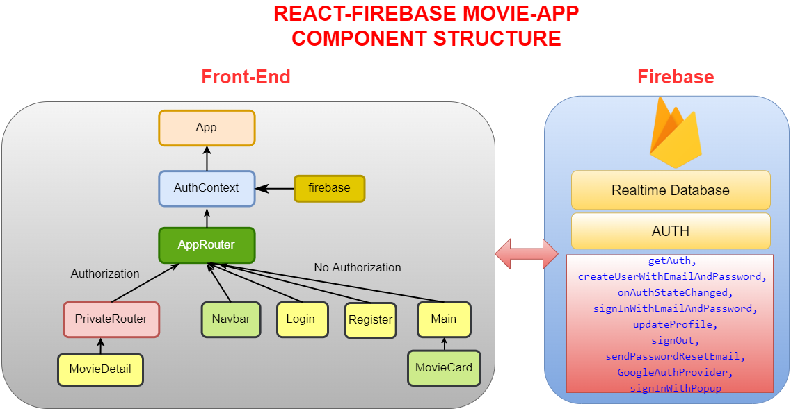

Movie-App23

## Description

Project aims to create a Movie App.

## Problem Statement

- We are adding a new project to our portfolios. So you and your colleagues have started to work on the project.

## Project Skeleton

```
Movie-App23 (folder)
|
|----readme.md         # Given to the students (Definition of the project)
SOLUTION
├── public
│     └── index.html
├── src
│    ├── auth
│    │     └── firebase.js
│    ├── components
│    │     ├── MovieCard.js
│    │     └── Navbar.js
│    ├── context
│    │     └── AuthContext.js
│    ├── pages
│    │     ├── Login.js
│    │     ├── Register.js
│    │     ├── Main.js
│    │     └── MovieDetail.js
│    ├── router
│    │     └── Router.js
│    ├── App.js
│    ├── App.css
│    ├── index.js
│    └── index.css
├── package.json
├── .env
└── yarn.lock
```



## Expected Outcome


## Objective

Build a Movie App using ReactJS.

### At the end of the project, following topics are to be covered;

- HTML

- CSS

- JS

- ReactJS

### At the end of the project, students will be able to;

- improve coding skills within HTML & CSS & JS & ReactJS.

- use git commands (push, pull, commit, add etc.) and Github as Version Control System.


## Steps to Solution

- Step 1 : Create React App using `npx create-react-app movie-app` and install firebase `npm i firebase` / `yarn add firebase`

- Step 2 : Signup `https://firebase.google.com/` and create new app in firebase.
  Firebase is a backed application development software that enables developers to develop iOS, Android and Web apps. It provides developers with a variety of tools and services to help them develop quality apps, grow their user base, and earn profit. It is built on Google’s infrastructure. Firebase offers a number of services, including: analytics,authentication, cloud messaging, realtime database, performance and test lab. Firebase is categorized as a NoSQL database program, which stores data in JSON-like documents.


- Step 3 : Use `https://firebase.google.com/docs/auth/web/start` and create `Authentication` operations.
  - Add the Firebase Authentication JS codes in your `firebase.js` file and initialize Firebase Authentication.

- Use this method to `Sign up new users`.

- Go to https://console.firebase.google.com => Authentication => sign-in-method => `enable Email/password`
- Use this method to `Sign in existing users`.

- Use this method to `Set an authentication state observer and get user data`.


- Go to https://console.firebase.google.com => Authentication => sign-in-method => `enable Google`
- Use this method to `Authenticate Using Google with Popup`.

- Use this method to `Sign Out`.

- Use this method to `Send a password reset email`.


- Step 4 : Signup `https://www.themoviedb.org/documentation/api` and get API key. In order to get data use `https://api.themoviedb.org/3/discover/movie?api_key=${API_KEY}`, to search movies use `https://api.themoviedb.org/3/search/movie?api_key=${API_KEY}&query=`, to get movie details use `https://api.themoviedb.org/3/movie/${id}?api_key=${API_KEY}` and to get video key use `https://api.themoviedb.org/3/movie/${id}/videos?api_key=${API_KEY}`. Use `https://image.tmdb.org/t/p/w1280${poster_path}` for image `src`.

- Step 5: You can use css frameworks like Bootstrap, Semantic UI, Material UI.

- Step 6: Add project gif/mp4 to your project and README.md file.
At the end of the project:


